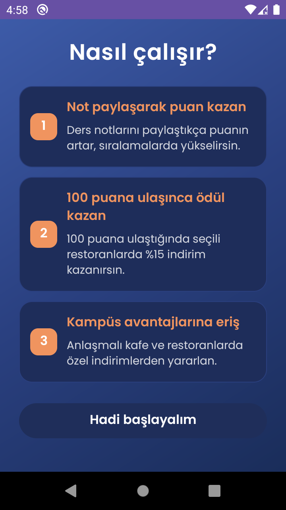
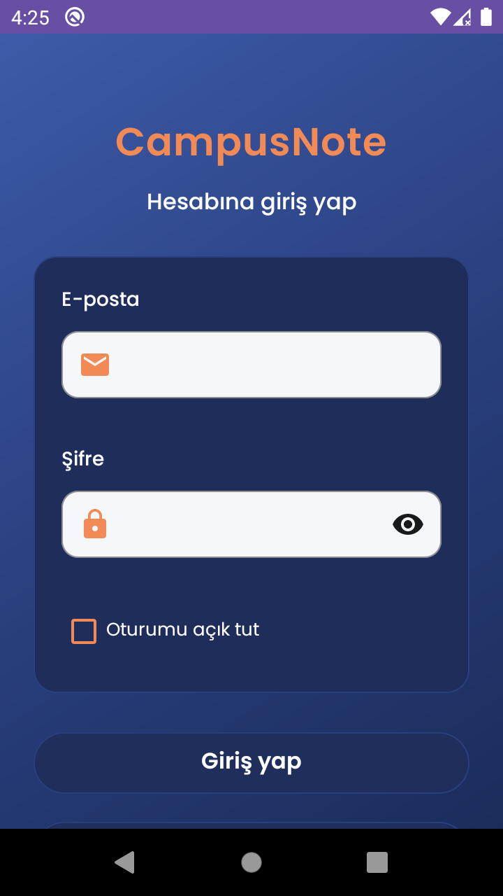
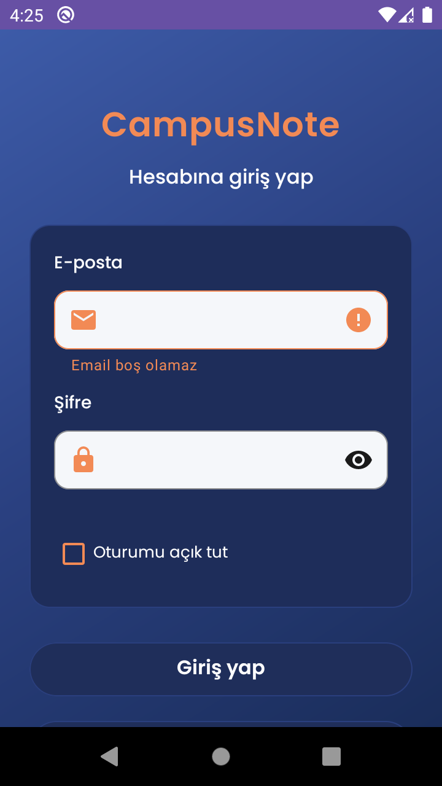
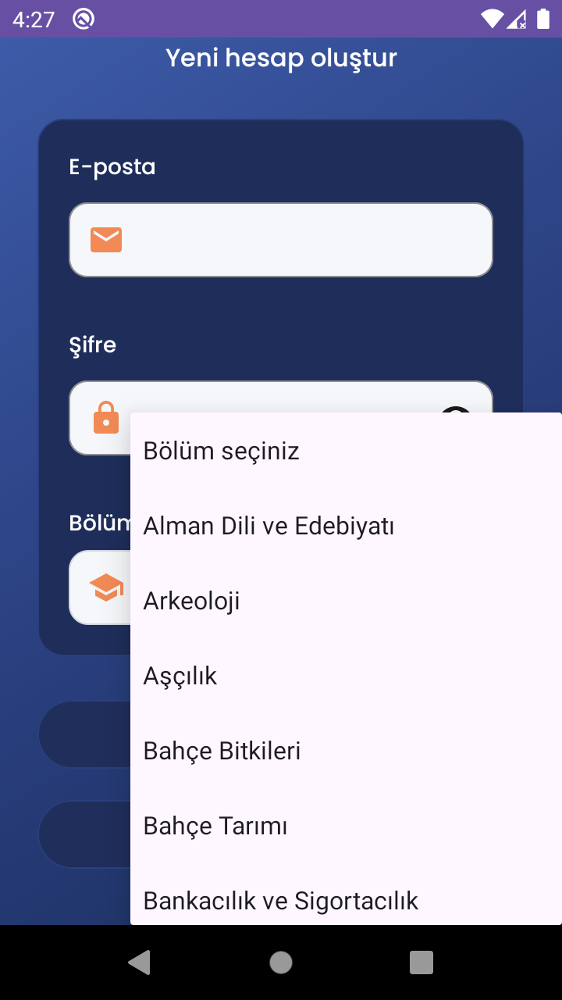
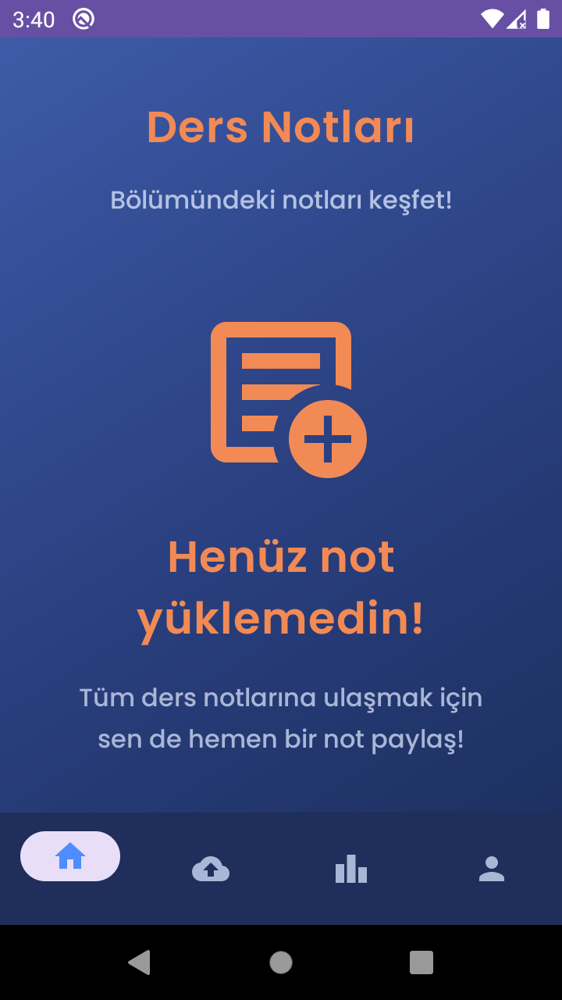
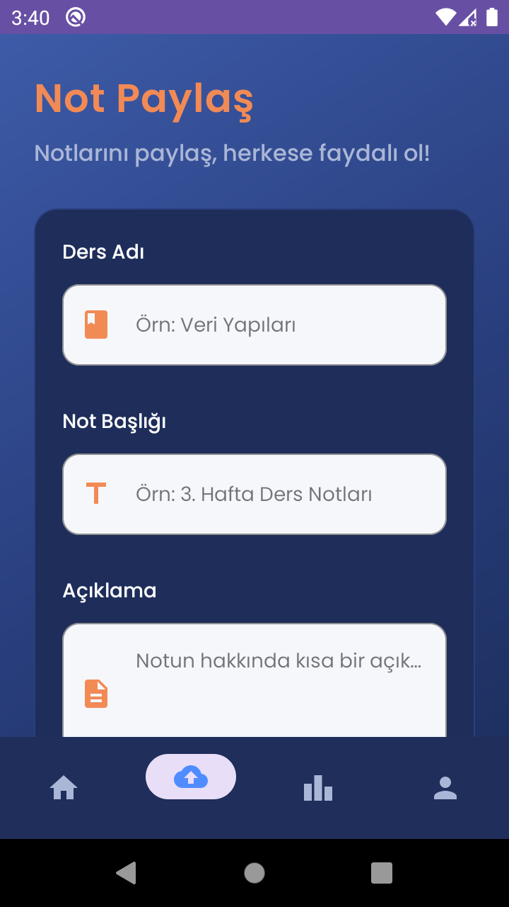
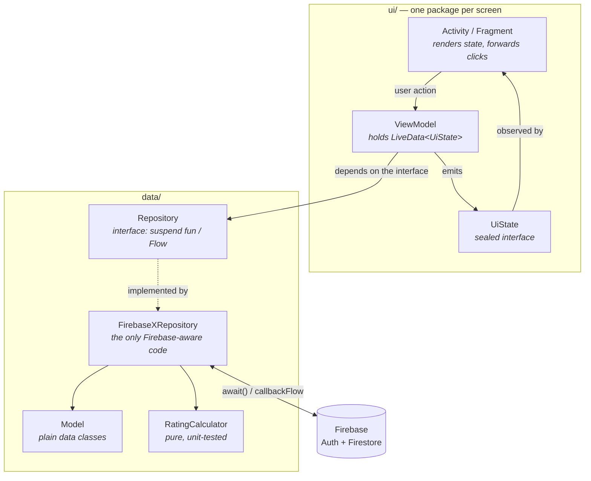

# CampusNote

An Android app for sharing lecture notes within a university department, built around
**contribution fairness**: you must upload at least one note of your own before the
department feed unlocks for you.

Built as a Mobile Programming course project at Akdeniz University, then refactored
into a portfolio piece.

[](https://github.com/duuyguyiilmaz/CampusNote/actions/workflows/android.yml)


---

## Screenshots

| Splash | Onboarding | Login |
|:---:|:---:|:---:|
|  |  |  |

| Input validation | Department picker | Locked feed |
|:---:|:---:|:---:|
|  |  |  |

| Upload | Leaderboard |
|:---:|:---:|
|  |  |

The leaderboard screenshot shows live Cloud Firestore data — notes ranked by total
score, read through a real-time snapshot listener. The accounts in it are test data.
Uploaders are shown by the local part of their address rather than the full email;
see [`UploaderName.kt`](app/src/main/java/duygu/yilmaz/campusnote/data/model/UploaderName.kt).

---

## Features

- **University email sign-up** — registration is restricted to `@ogr.akdeniz.edu.tr` addresses
- **Department selection** from the full list of 144 Akdeniz University departments
- **Contribution gate** — the department feed stays locked until you upload your first note
- **Note upload** as PDF or image, with automatic image downscaling and compression
- **Note rating** on a 1–5 scale; you cannot rate your own notes, and re-rating replaces
  your previous vote instead of adding a second one
- **Leaderboard** ranking notes by total score, with gold/silver/bronze placings
- **Points and rewards** — uploaders earn points from ratings; discounts unlock at 100 points
- **Note management** — edit or delete your own notes from your profile

---

## Architecture

The app follows MVVM with a repository layer. Firebase types stay behind the
repositories and never reach the `ui` package, and every Firebase call is a `suspend`
function bridged with `.await()`, so none of them block the main thread.



**Key decisions**

- **Every screen exposes a sealed `UiState`.** Loading, empty, error and content are
  distinct types rather than a bag of nullable fields and booleans, so the render
  function is an exhaustive `when` the compiler checks for you.
- **Firestore listeners become `Flow`s.** `callbackFlow` + `awaitClose` removes the
  listener when collection stops, so there is no separate "stop listening" call to
  forget.
- **Multi-document writes are atomic.** Creating a note writes the metadata document
  and the file content document in one `runBatch`, so a note can never exist without
  its content or vice versa.
- **The contribution gate is derived, not stored.** Whether the feed unlocks is decided
  by a `limit(1)` query for the user's own notes rather than a `hasUploadedNote` flag on
  the profile. A stored flag drifted: it was set on upload and never cleared on delete,
  so uploading once and deleting granted permanent access.
- **Rating uses a transaction.** `runTransaction` re-reads the note inside the
  transaction, so two people rating the same note at once cannot lose one of the votes.
- **File content lives in a subcollection.** `notes/{id}/content/file` is separate from
  the note metadata so feed and leaderboard queries never download file data.
- **Rating arithmetic is a pure function.** `RatingCalculator` has no Firebase
  dependency, which is what makes it unit-testable — see [Tests](#tests).
- **Repositories are interfaces.** Each one has a single Firebase-backed implementation
  (`FirebaseNoteRepository`, …) that ViewModels only see through the interface. Kotlin
  classes are final, so as concrete classes they could not be substituted in a test
  without a mocking framework — and their constructors called `FirebaseFirestore
  .getInstance()`, which throws on the JVM. The split is what makes every ViewModel
  testable with a hand-written fake.

---

## Tech stack

| Concern | Choice |
|---|---|
| Language | Kotlin 2.0.21 |
| UI | Views + ViewBinding (no Compose) |
| Async | Coroutines, `Flow`, `LiveData` |
| Auth | Firebase Authentication (email/password) |
| Database | Cloud Firestore |
| Build | Gradle 8.13, AGP 8.13.2, version catalog |
| Tests | JUnit 4, `kotlinx-coroutines-test`, `androidx.arch.core:core-testing` |

---

## Data model

Cloud Firestore, four collections:

**`users/{uid}`**

| Field | Type | Notes |
|---|---|---|
| `id` | string | matches the Firebase Auth UID |
| `email` | string | |
| `department` | string | |
| `points` | number | earned from ratings on your notes |
| `createdAt` | number | |

Older user documents may still carry a `hasUploadedNote` boolean. It is no longer read
or written — the contribution gate is derived from the user's notes instead.

**`notes/{noteId}`**

| Field | Type | Notes |
|---|---|---|
| `title`, `description`, `course`, `tag` | string | |
| `department` | string | the feed filters on this |
| `uploaderUid`, `uploaderEmail` | string | |
| `fileName`, `fileType`, `fileSize` | string / string / number | `fileType` is `pdf`, `image` or empty |
| `ratingSum`, `ratingCount`, `avgRating` | number | denormalised so the feed needs no aggregation |
| `createdAt`, `updatedAt` | timestamp | |

**`notes/{noteId}/content/file`** — one field, `fileData`, holding the base64 file content.

**`ratings/{uid}_{noteId}`** — `uid`, `noteId`, `rating`. The composite document ID is what
enforces one vote per user per note.

---

## Security rules

Firestore rules live in [`firestore.rules`](firestore.rules) rather than only in the
Firebase Console, so they can be reviewed and versioned. Deploy with:

```bash
firebase deploy --only firestore:rules
```

The rules require authentication everywhere, restrict note edits and deletes to the
uploader, and pin each rating document to its author's UID. Note that the delete rule
is the *only* ownership check on deletion — the app code does not verify it.

They are covered by their own test suite; see [Rules tests](#rules-tests).

---

## Known limitations

Honest list of things a reviewer would spot, and why they are the way they are.

**Note files are base64-encoded into Firestore, capping uploads at ~650 KB.**
The right answer is Firebase Storage, which stores binary data as-is with no such
limit. Storage requires the billed Blaze plan, and this project stays on the free
Spark plan, so files are base64-encoded into a Firestore document instead. Since
base64 inflates data by about a third and a Firestore document may not exceed 1 MiB,
the practical ceiling is ~650 KB. Images are downscaled and re-compressed to fit;
larger PDFs are rejected with a clear message.

**The points system is client-authoritative.**
Rating a note updates the note's totals *and* the uploader's `points` directly from the
client, so the security rules have to permit one user to modify another user's points.
Values are constrained by type and range, but a malicious client could still award
itself points. The correct fix is to move the calculation into a Cloud Function so the
client only writes its vote — which again needs the Blaze plan.

**Email addresses are never verified.** Registration only checks that the address ends
in `@ogr.akdeniz.edu.tr`; no confirmation mail is sent, so anyone can register with a
made-up address on that domain. The "university students only" rule is therefore a
convention, not a guarantee. Calling `sendEmailVerification()` after sign-up and gating
the feed on `FirebaseUser.isEmailVerified` would close this, at the cost of a
confirmation step during registration.

**No pagination.** The feed and leaderboard read every matching note and sort in
memory. Fine at course-project scale, wrong at department scale.

**`notifyDataSetChanged()` instead of `DiffUtil`.** The adapters rebuild the whole list
on every update, losing item animations.

**The leaderboard and profile report errors with a `Toast`.** A toast cannot be acted
on, so a failed read there still leaves retrying up to the user guessing. The feed uses
a snackbar with a retry action; the other two screens have not followed yet.

**The report mechanism is unimplemented.** It is part of the original project brief but
there is no code for it, so the security rules deliberately deny the `reports` collection.

---

## Getting started

**Prerequisites** — Android Studio (Ladybug or newer), JDK 21, an Android device or
emulator on API 24+.

1. **Clone**

   ```bash
   git clone https://github.com/duuyguyiilmaz/CampusNote.git
   ```

2. **Create a Firebase project** and register an Android app with the package name
   `duygu.yilmaz.campusnote`.

3. **Enable Email/Password authentication** in Firebase Console → Authentication →
   Sign-in method.

4. **Download `google-services.json`** from the Firebase Console into `app/`. This file
   is deliberately **not** committed — each developer supplies their own, so a clone
   never writes into someone else's Firestore. `app/google-services.json.example` shows
   the expected shape:

   ```bash
   cp app/google-services.json.example app/google-services.json   # then paste in your real values
   ```

5. **Deploy the security rules** (see [Security rules](#security-rules)), or the app
   will be blocked from reading and writing.

6. **Build and run**

   ```bash
   ./gradlew installDebug
   ```

> **Building from the terminal?** Gradle needs a valid `JAVA_HOME`. If it fails with
> *"JAVA_HOME is set to an invalid directory"*, point it at the JDK bundled with
> Android Studio:
> ```bash
> # Windows (PowerShell)
> $env:JAVA_HOME = "C:\Program Files\Android\Android Studio\jbr"
> ```
> Android Studio itself is unaffected — it uses that JDK without consulting `JAVA_HOME`.

---

## Tests

```bash
./gradlew testDebugUnitTest
```

87 JVM unit tests, no emulator and no network. They cover the two layers where a bug
would be invisible rather than loud: the scoring arithmetic, and the decision logic in
every ViewModel.

| Suite | What it pins down |
|---|---|
| `RatingCalculatorTest` | First-time votes, changed votes, unchanged votes, average recalculation, and two inconsistent-data guards — the total flooring at zero, and the vote count flooring at one so the average never divides by zero. |
| `FeedViewModelTest` | The contribution gate: locked without an upload, unlocked with one, and locked for a missing profile or a blank department. Also asserts the department query is never even built while locked. |
| `UploadViewModelTest` | The uid, email and department written onto a note, including the `UNKNOWN_DEPARTMENT` fallback that keeps a blank department out of `whereEqualTo` queries. |
| `NoteDetailViewModelTest` | Metadata and file content loading as separate states, no file read for a note without one, and the rating rules (own note, missing session, deleted note). |
| `EditNoteViewModelTest` | Ownership and session handling on load and save. |
| `ProfileViewModelTest` | Total points summed from the user's own notes, and note deletion. |
| `LoginViewModelTest`, `RegisterViewModelTest` | State transitions, and which of registration's two steps — auth account or profile document — failed. |
| `LeaderboardViewModelTest`, `MainViewModelTest`, `UploaderNameTest` | Empty vs. content, session routing, and the uploader-name masking shared by three screens. |

ViewModel tests use hand-written fakes of the repository interfaces
([`FakeRepositories.kt`](app/src/test/java/duygu/yilmaz/campusnote/testing/FakeRepositories.kt))
rather than a mocking framework, so a test reads as "given this data, what does the
ViewModel do" instead of a list of stubbed calls.

`viewModelScope` runs on `Dispatchers.Main`, which does not exist on the JVM, so
[`MainDispatcherRule`](app/src/test/java/duygu/yilmaz/campusnote/testing/MainDispatcherRule.kt)
swaps in a `StandardTestDispatcher`. It queues coroutines until `advanceUntilIdle()`,
which is what lets the tests assert the intermediate `Loading` state and the
double-submit guards that depend on it.

### Rules tests

```bash
cd firestore-tests
npm ci
npm test
```

The JVM tests above stop at the repository interfaces, so everything Firestore itself
enforces — who may delete a note, who may write to whose `points` — was previously
unverified. That is the layer an attacker actually meets: the Android client can be
replaced, the rules cannot.

32 tests in [`firestore-tests/rules.test.js`](firestore-tests/rules.test.js) run
[`firestore.rules`](firestore.rules) against the local Firestore emulator through
`@firebase/rules-unit-testing`. `npm test` starts the emulator, runs the suite and shuts
it down again; nothing touches the real project, and no billing account is involved.

| Group | What it pins down |
|---|---|
| `signed-out access` | Every collection is closed to an unauthenticated client — the one guard shared by all four rule blocks. |
| `users` | Self-registration only, the document id matching the `id` field, and the narrow exception that lets a rater raise *another* user's `points` — including that it cannot carry a second field along, go negative, or be a non-integer. |
| `notes` | `uploaderUid` cannot be forged on create; metadata edits are the uploader's alone; a rater may touch only `ratingSum`, `ratingCount` and `avgRating`; delete is owner-only. |
| `note content` | The batched note-plus-file upload, owner-only replace and delete, and a test that deliberately asserts the *open* create rule, so the gap documented in `firestore.rules` cannot be closed by accident and go unnoticed. |
| `ratings` | The `<uid>_<noteId>` document id, which is what stops one user voting as another, plus the 1–5 integer range and the ban on deleting votes. |
| `unmatched paths` | A collection with no rule stays closed, including the `reports` collection mentioned in this README but never implemented. |

Fixtures are seeded with `withSecurityRulesDisabled`, so a broken rule surfaces as a
failed assertion rather than a failed setup. Each suite asserts both directions — the
allowed write succeeding and the forged one being denied — because a rule that rejects
everything would otherwise pass a suite made only of `assertFails`.

### Continuous integration

[`.github/workflows/android.yml`](.github/workflows/android.yml) runs on every push to
`main` and on every pull request. Two jobs run in parallel: unit tests, a debug build and
Android Lint; and the Firestore rules suite against the emulator. The debug APK and the
test report are uploaded as build artifacts.

Because `google-services.json` is not in the repository, CI copies the example file into
place before building. The placeholder credentials are enough — the Google Services
plugin only parses the file at build time and never contacts Firebase.

---

## Project structure

```
app/src/main/java/duygu/yilmaz/campusnote/
├── data/
│   ├── local/          NoteFileEncoder, OnboardingPreferences
│   ├── model/          data classes + RatingCalculator
│   └── repository/     Auth, User, Note, Rating — interface + Firebase impl each
└── ui/
    ├── auth/           login + register
    ├── common/         PostAdapter, shared by feed and profile
    ├── editnote/
    ├── feed/
    ├── leaderboard/
    ├── main/           MainActivity, bottom navigation host
    ├── notedetail/
    ├── onboarding/
    ├── profile/
    ├── splash/
    └── upload/

app/src/test/java/duygu/yilmaz/campusnote/
├── data/model/         RatingCalculatorTest, UploaderNameTest
├── testing/            fakes, fixtures, MainDispatcherRule
└── ui/                 one test class per ViewModel

firestore-tests/        emulator-backed tests for firestore.rules
```

---

## Author

**Duygu Yılmaz** — Computer Engineering, Akdeniz University
[github.com/duuyguyiilmaz](https://github.com/duuyguyiilmaz)

## License

Released under the [MIT License](LICENSE).
