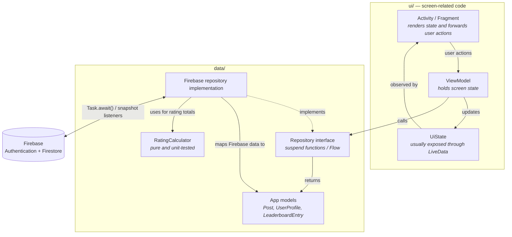

# CampusNote

An Android app for sharing lecture notes within a university department, built around
**contribution fairness**: you must upload at least one note of your own before the
department feed unlocks for you.

CampusNote is a small Android application developed as part of the Mobile Programming
course at Akdeniz University.

[](https://github.com/duuyguyiilmaz/CampusNote/actions/workflows/android.yml)


---

## Screenshots

| Splash | Onboarding | Login |
|:---:|:---:|:---:|
|  |  |  |

| Input validation | Department picker | Locked feed |
|:---:|:---:|:---:|
|  |  |  |

| Upload | Leaderboard |
|:---:|:---:|
|  |  |

The leaderboard screenshot shows live Cloud Firestore data read through a real-time
snapshot listener; the accounts in it are test data.

---

## Features

- **Onboarding flow** — introduces the main functionality when the app is opened for the first time
- **Authentication** — users can register and sign in with Firebase Authentication
- **University-domain sign-up** — profile creation requires an email address ending in
  `@ogr.akdeniz.edu.tr`; email ownership is not verified
- **Department selection** — users choose from a list of 144 Akdeniz University departments
- **Contribution gate** — the department feed remains locked until the user uploads their first note
- **Incrementally loaded feed** — 20 more notes are included as the user scrolls
- **Note upload** — PDF or image files can be shared, with image resizing and compression
- **Note details** — users can view note information, preview images and open PDF files
- **Note rating** — notes can be rated from 1 to 5; users cannot rate their own notes,
  and re-rating replaces the previous vote instead of adding a second one. The vote
  document and the note's totals are updated in a Firestore transaction, while the
  security rules validate the result. A note's score is the total of its votes, not
  an average (see [Security rules](#security-rules))
- **Department leaderboard** — displays the 50 highest-scoring notes in the user's department
- **Points and demo rewards** — points are calculated from the scores received by the
  user's notes; reaching 100 points reveals static sample discount cards
- **Note management** — users can edit the information of their own notes or delete them

---

## Architecture

The app follows MVVM with a repository layer. One-time Firebase operations are
exposed as `suspend` functions and bridged with `.await()`, while real-time
Firestore updates are exposed as `Flow` using snapshot listeners. Firestore-specific
types such as `DocumentSnapshot`, `Query`, and `Timestamp` are converted into app models
inside the repository implementations before reaching the ViewModels.

The separation is not absolute. Firebase-dependent ViewModels declare repository
interfaces but provide Firebase implementations as default constructor arguments.
This allows Android UI components to create them without a custom factory, while
tests can inject fake repositories. In addition,
[`AuthErrorMessages`](app/src/main/java/duygu/yilmaz/campusnote/ui/auth/AuthErrorMessages.kt)
maps `FirebaseAuthException.errorCode` directly to user-facing messages. These are
deliberate trade-offs: the project does not use a dependency-injection framework or
translate Firebase authentication failures into app-specific exception types.



**Key decisions**

- **Most data-driven screens expose a sealed state type.** Each screen models only
  the states it needs — such as loading, content, empty, locked or error — instead
  of combining nullable values and multiple boolean flags. This allows rendering
  code to use an exhaustive `when` expression, while simple screens such as splash
  and onboarding do not need this pattern.
- **Firestore snapshot listeners are exposed as `Flow`s.** `callbackFlow` forwards
  snapshot updates, and `awaitClose` removes the underlying Firebase listener when
  the collecting coroutine is cancelled. Feed and leaderboard cancel their collection
  in `onStop`, so their listeners do not remain active in the background.
- **Attached files are written atomically with note metadata.** `createNote` uses a
  Firestore batch: it always writes the metadata document and, when a file is selected,
  writes the content document in the same commit. Either every write in the batch
  succeeds or none does; notes without attachments intentionally contain only metadata.
- **The contribution gate is derived from existing notes, not stored in the user
  profile.** Before loading the feed, the app queries for at most one note uploaded
  by the current user using `limit(1)`. This avoids a stale `hasUploadedNote` flag:
  if the user's last note is deleted, the next check finds no note and locks the
  feed again.
- **The leaderboard is intentionally capped at 50 entries.** Firestore filters notes
  by the user's department, orders them by `ratingSum` in descending order and applies
  `limit(50)`. This limit belongs to the ranking screen rather than the access rules;
  the department feed remains incrementally loadable for browsing other notes.
- **The feed expands a single live query window.** It starts with `limit(20)`.
  When the user nears the end, the current listener is cancelled and replaced with
  a new listener using a larger limit: 40, 60 and so on. This keeps only one real-time
  listener active and avoids merging multiple live page queries. The trade-off is that
  earlier documents may be read again as the window grows, while users who remain on
  the first page avoid loading the entire department feed.
- **Points are derived from note scores.** `ProfileViewModel` calculates
  `totalPoints` by summing `ratingSum` across the current user's notes. No separate
  point total is stored in the user profile, keeping note scores as the single source
  of truth. The profile already loads these notes for the note-management list, so
  the same data provides both the list and the total.
- **Ratings are updated in a Firestore transaction.** The transaction reads both the
  note and the rater's existing vote, recalculates `ratingSum` and `ratingCount`, and
  writes the updated totals and vote document together. If another client changes a
  document read by the transaction before it commits, Firestore retries the transaction
  with fresh data, preventing concurrent votes from overwriting one another.
- **File content is stored in a subcollection.** Base64 content is written to
  `notes/{id}/content/file`, while note metadata remains in the parent document.
  Firestore does not include subcollection documents when querying `notes`, so feed
  and leaderboard queries do not download attached file content.
- **Files use Base64 in Firestore instead of Cloud Storage.** Cloud Storage for
  Firebase requires a billing-enabled Blaze plan, while this project is designed
  to remain compatible with the Spark plan. `NoteFileEncoder` converts attachments
  to Base64 and limits the encoded string to 900,000 characters, corresponding
  conservatively to about 650 KB of raw file data. This accounts for Base64's
  roughly 33% size increase and Firestore's 1 MiB document limit. Images are
  downscaled and recompressed; any attachment that still exceeds the limit is
  rejected with an explanatory message.
- **Rating arithmetic is isolated as a pure function.** `RatingCalculator` receives
  numeric inputs and returns `RatingTotals` without accessing Firebase, Android state
  or other external data. This makes first-time votes and changed-vote calculations
  directly unit-testable — see [Tests](#tests).
- **Firebase repositories implement testable interfaces.** `AuthRepository`,
  `UserRepository`, `NoteRepository` and `RatingRepository` each have one
  Firebase-backed implementation. Firebase-dependent ViewModels accept these
  interface types, so tests can supply hand-written fakes instead of connecting
  to Firebase. Production defaults still instantiate the Firebase implementations
  in constructor arguments, so this improves testability without providing full
  dependency injection.

---

## Tech stack

| Concern | Choice |
|---|---|
| Language | Kotlin 2.0.21 |
| Android SDK | minSdk 24, compileSdk 35, targetSdk 35 |
| UI | XML layouts, Android Views, Material Components and ViewBinding (no Compose) |
| Async and state | Coroutines, `Flow` and `LiveData` |
| Authentication | Firebase Authentication with email/password |
| Database | Cloud Firestore; file content is stored as Base64 rather than in Cloud Storage |
| Dependency management | Firebase BoM 33.9.0 and Gradle version catalog |
| Build | Gradle 8.13, AGP 8.13.2 and JVM target 11 |
| Tests | Local JVM tests with JUnit 4, `kotlinx-coroutines-test`, `core-testing`, Robolectric and Espresso APIs |

Colours live only in [`colors.xml`](app/src/main/res/values/colors.xml). No layout or
drawable writes a raw hex, so a tone can be found, counted and changed in one place.

---

## Data model

Cloud Firestore uses three top-level collections and one optional note-content
subcollection:

**`users/{uid}`**

| Field | Type | Notes |
|---|---|---|
| `id` | string | matches the Firebase Auth UID |
| `email` | string | must equal the session's own address, and end in `@ogr.akdeniz.edu.tr` |
| `department` | string | non-empty; `ownDepartment()` reads it to decide what the account may read |
| `createdAt` | timestamp | written with the server time (`request.time`) |

**`notes/{noteId}`**

| Field | Type | Notes |
|---|---|---|
| `title`, `description`, `course`, `tag` | string | `tag` may be empty |
| `department` | string | the feed and the leaderboard both filter on this |
| `uploaderUid`, `uploaderName` | string | `uploaderName` is derived from the part before the `@`; the email address is not stored on the note |
| `fileName`, `fileType`, `fileSize` | string / string / integer | `fileType` is `pdf`, `image` or empty; `fileSize` is the raw size in bytes |
| `ratingSum`, `ratingCount` | integer | denormalised so feed and leaderboard queries need no aggregation; `ratingSum` is the displayed score |
| `createdAt` | timestamp | written with the server time when the note is created |
| `updatedAt` | timestamp, optional | added when the note metadata is edited |

**`notes/{noteId}/content/file`** — an optional document containing `fileData`, a Base64 string.

**`ratings/{uid}_{noteId}`**

| Field | Type | Notes |
|---|---|---|
| `uid` | string | matches the authenticated user's UID |
| `noteId` | string | identifies the rated note |
| `rating` | integer | between 1 and 5 |

The deterministic document ID and the security rules together enforce one vote per user
per note.

---

## Security rules

Firestore Security Rules are versioned in
[`firestore.rules`](firestore.rules) and covered by the
[Rules tests](#rules-tests). The repository copy is not deployed automatically:

```bash
firebase deploy --only firestore:rules
```

| Resource | Access enforced by the rules |
|---|---|
| `users/{uid}` | Users can read and create only their own profile. Registration requires the authenticated university email, an exact field set and a server timestamp. Profile updates and deletes are denied. |
| `notes/{noteId}` | Users can read notes from their own department and their own uploads. New notes must use the authenticated identity and profile department. Metadata edits and deletion are owner-only. |
| `notes/{noteId}/content/file` | File content follows the note's department read scope and can be created, replaced or deleted only by the note owner. |
| `ratings/{uid}_{noteId}` | Users can read their own ratings, while note owners can read ratings on their notes. A rating must use the authenticated user's deterministic document ID and an integer from 1 to 5. Rating one's own note is denied, and rating changes must update the note totals in the same commit. A rating can be deleted only with its note. |

All operations require authentication, and paths without an explicit rule are denied.
Rating documents and note totals are cross-validated with `getAfter()` so neither can
be changed independently.

---

## Known limitations

- Tests run on the JVM; the project has no device-based instrumentation test suite.
- ViewModel tests use fake repositories, so they do not execute real Firestore queries.
  Firestore Security Rules are tested separately against the local emulator.
- Registration accepts addresses ending in `@ogr.akdeniz.edu.tr`, but does not verify
  that the user owns the email address.
- Rating totals are calculated by the client. Security rules independently validate the
  resulting vote document and note totals before accepting the write.
- Firebase Authentication account creation and Firestore profile creation cannot be one
  atomic operation. If profile creation fails, the app attempts to delete the new account
  and provides a profile-completion screen for signed-in accounts without a profile.

---

## Getting started

**Prerequisites** — Android Studio or equivalent Android SDK tooling, JDK 21, the
[Firebase CLI](https://firebase.google.com/docs/cli), and an Android device or emulator
running API 24 or newer.

1. **Clone**

   ```bash
   git clone https://github.com/duuyguyiilmaz/CampusNote.git
   cd CampusNote
   ```

2. **Configure Firebase**

   - Create a Firebase project.
   - Register an Android app with the package name `duygu.yilmaz.campusnote`.
   - In Authentication → Sign-in method, enable Email/Password.
   - Create a Cloud Firestore database. Production mode is the safer starting option
     because the repository's rules will be deployed in a later step.

3. **Add the Firebase configuration**

   Download `google-services.json` for the registered Android app and place it at
   `app/google-services.json`. The real file is not committed because each developer
   must connect the app to their own Firebase project. The committed
   `app/google-services.json.example` file only shows the expected structure and cannot
   connect to Firebase.

4. **Deploy the Firestore configuration**

   ```bash
   firebase login
   firebase deploy --only firestore --project <your-project-id>
   ```

   Run these commands from the repository root. The deploy command sends both
   `firestore.rules` and `firestore.indexes.json` to the selected Firebase project.
   Replace `<your-project-id>` with the project ID shown in Firebase Console.

5. **Build and install**

   Windows PowerShell:

   ```powershell
   .\gradlew.bat installDebug
   ```

   macOS or Linux:

   ```bash
   ./gradlew installDebug
   ```

   Start an emulator or connect an Android device before running the command.

> **Building from the terminal?** Gradle needs a valid `JAVA_HOME`. If it fails with
> *"JAVA_HOME is set to an invalid directory"*, point it to your JDK 21 installation:
>
> ```powershell
> # Windows (PowerShell)
> $env:JAVA_HOME = "C:\path\to\jdk-21"
> ```

---

## Tests

### Android tests

```powershell
# Windows
.\gradlew.bat testDebugUnitTest
```

```bash
# macOS or Linux
./gradlew testDebugUnitTest
```

The local JVM suite covers rating calculations, ViewModel behaviour, list adapters,
authentication error messages and the feed's contribution gate. Repository fakes keep
these tests independent from Firebase, while Robolectric and Espresso verify the feed
screen without requiring an Android device or emulator.

### Firestore Rules tests

```bash
cd firestore-tests
npm ci
npm test
```

These tests run `firestore.rules` against the local Firestore emulator. They cover
authentication, department-based access, ownership, field validation and atomic rating
updates. The suite does not connect to or modify a live Firebase project.

---

## Continuous integration

[`.github/workflows/android.yml`](.github/workflows/android.yml) runs on every push to
`main` and on every pull request. Two jobs run in parallel: unit tests, a debug build and
Android Lint; and the Firestore rules suite against the emulator. The debug APK and the
test report are uploaded as build artifacts.

Because `google-services.json` is not in the repository, CI copies the example file into
place before building. The placeholder credentials are enough — the Google Services
plugin only parses the file at build time and never contacts Firebase.

That is also the limit of what CI can tell you about the security rules: it runs
`firestore.rules` against the emulator, which proves the file is correct and says nothing
about whether the Firebase project is running it. Nothing here holds credentials for the
live project, so nothing here can check. Deploying is part of merging a rules change — see
[Known limitations](#known-limitations).

---

## Project structure

High-level structure of the application and its supporting Firebase files:

```
app/
├── src/main/
│   ├── java/duygu/yilmaz/campusnote/
│   │   ├── data/
│   │   │   ├── local/       file encoding and onboarding preferences
│   │   │   ├── model/       app data classes and rating calculation
│   │   │   └── repository/  repository interfaces and Firebase implementations
│   │   └── ui/
│   │       ├── auth/        login, registration and missing-profile recovery
│   │       ├── common/      shared note-list adapter
│   │       └── ...          feed, upload, note detail, edit, profile,
│   │                        leaderboard, onboarding, splash and main navigation
│   └── res/                 layouts, menus, strings, colours and drawables
├── src/test/java/duygu/yilmaz/campusnote/
│   ├── data/model/          pure model and rating tests
│   ├── testing/             repository fakes, fixtures and coroutine test rule
│   └── ui/                  ViewModel, adapter, authentication UI and feed screen tests
└── build.gradle.kts         Android module configuration and dependencies

firestore-tests/rules.test.js  emulator-backed tests for Firestore Security Rules
firestore.rules                access and data-validation rules
firestore.indexes.json         composite query indexes
firebase.json                  Firebase CLI and emulator configuration
gradle/libs.versions.toml       dependency and plugin versions
```

---

## Author

**Duygu Yılmaz** — Computer Engineering, Akdeniz University
[github.com/duuyguyiilmaz](https://github.com/duuyguyiilmaz)

## License

Released under the [MIT License](LICENSE).
