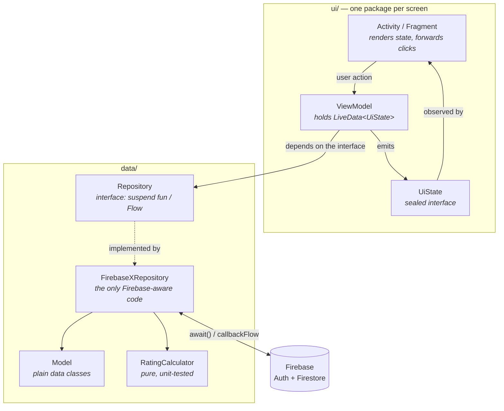

# CampusNote

An Android app for sharing lecture notes within a university department, built around
**contribution fairness**: you must upload at least one note of your own before the
department feed unlocks for you.

Built as a Mobile Programming course project at Akdeniz University, then refactored
into a portfolio piece.

[](https://github.com/duuyguyiilmaz/CampusNote/actions/workflows/android.yml)


---

## Screenshots

| Splash | Onboarding | Login |
|:---:|:---:|:---:|
|  |  |  |

| Input validation | Department picker | Locked feed |
|:---:|:---:|:---:|
|  |  |  |

| Upload | Leaderboard |
|:---:|:---:|
|  |  |

The leaderboard screenshot shows live Cloud Firestore data read through a real-time
snapshot listener; the accounts in it are test data. It was captured before the ranking
was scoped to the viewer's own department, so the list it shows is wider than what the
app now returns. Uploaders appear as the local part of their address rather than the
full email — and since the change described under [Security rules](#security-rules) that
is no longer a rendering choice: the address is never written to the note at all, only
the name, derived by
[`UploaderName.kt`](app/src/main/java/duygu/yilmaz/campusnote/data/model/UploaderName.kt).

---

## Features

- **University email sign-up** — registration is restricted to `@ogr.akdeniz.edu.tr` addresses
- **Department selection** from the full list of 144 Akdeniz University departments
- **Contribution gate** — the department feed stays locked until you upload your first note
- **Paged feed** — notes load 20 at a time as you scroll; every note in the department is still reachable
- **Note upload** as PDF or image, with automatic image downscaling and compression
- **Note rating** on a 1–5 scale; you cannot rate your own notes, and re-rating replaces
  your previous vote instead of adding a second one — both enforced by the security
  rules, not just the app. A note's score is the running total of its votes, not an
  average: the total is the one figure the rules can verify exactly (see
  [Security rules](#security-rules))
- **Leaderboard** ranking your department's top 50 notes by total score, with gold/silver/bronze placings
- **Points and rewards** — your total is the score your own notes have earned; discounts unlock at 100 points
- **Note management** — edit or delete your own notes from your profile

---

## Architecture

The app follows MVVM with a repository layer. Every Firebase call is a `suspend`
function bridged with `.await()`, so none of them block the main thread, and Firebase
data types — `DocumentSnapshot`, `Query`, `Timestamp` — stop at the repositories; the
`ui` package only ever sees the plain data classes in `data/model`.

Two places do reach across that line, and calling the separation absolute would be
overstating it. Each ViewModel defaults its constructor to the Firebase-backed
implementation (`AuthRepository = FirebaseAuthRepository()`), which is what lets the
Activity create it with no wiring — the interface is still what the body depends on, and
what every test substitutes, but the default names a concrete Firebase class. And
[`AuthErrorMessages`](app/src/main/java/duygu/yilmaz/campusnote/ui/auth/AuthErrorMessages.kt)
matches on `FirebaseAuthException.errorCode` to pick an error message, because that code
is the only stable description of what went wrong; the alternative, translating every
failure into an app-specific type at the repository, is more indirection than one screen's
error text is worth. Both are deliberate; neither is invisible.



**Key decisions**

- **Every screen exposes a sealed `UiState`.** Loading, empty, error and content are
  distinct types rather than a bag of nullable fields and booleans, so the render
  function is an exhaustive `when` the compiler checks for you.
- **Firestore listeners become `Flow`s.** `callbackFlow` + `awaitClose` removes the
  listener when collection stops, so there is no separate "stop listening" call to
  forget.
- **Multi-document writes are atomic.** Creating a note writes the metadata document
  and the file content document in one `runBatch`, so a note can never exist without
  its content or vice versa.
- **The contribution gate is derived, not stored.** Whether the feed unlocks is decided
  by a `limit(1)` query for the user's own notes rather than a `hasUploadedNote` flag on
  the profile. A stored flag drifted: it was set on upload and never cleared on delete,
  so uploading once and deleting granted permanent access.
- **The leaderboard is capped rather than paged.** It asks Firestore for the department's
  top 50 by `ratingSum` and stops there. A leaderboard is a "top N" view by nature, and
  paging one to rank 300 is machinery for a question nobody asks. It is not an access
  restriction either: every note is reachable through the feed, which is the path to the
  content — this screen is a ranking of it.
- **The feed pages by growing one listener, not by stitching queries.** Notes arrive
  through a live Firestore listener, so paging with a second query would leave two
  windows with different freshness and no clear owner of the order. Instead the same
  listener is re-subscribed with a larger `limit` as the user nears the end. The cost is
  explicit: widening the window re-reads the notes already seen, so 20 + 40 is 60
  document reads rather than 40. Reading the department's *entire* collection on every
  open — the previous behaviour — is far more expensive, and most readers never leave
  the first page.
- **Points are derived too, and that is what made them safe.** A user's point total is
  the sum of `ratingSum` over their own notes, computed where it is displayed. It used to
  live in `users.points`, written by whoever cast the vote — which forced the rules to
  let one user write another user's document, and left the owner able to write their own.
  Deleting the field deleted both holes; nothing read it anyway.
- **Rating uses a transaction.** `runTransaction` re-reads the note inside the
  transaction, so two people rating the same note at once cannot lose one of the votes.
- **File content lives in a subcollection.** `notes/{id}/content/file` is separate from
  the note metadata so feed and leaderboard queries never download file data.
- **Files are base64 in Firestore, not in Storage.** Firebase Storage is the usual home
  for binary data, but it requires the billed Blaze plan and this project stays on the
  free Spark plan. Encoding the file into a Firestore document keeps uploads working
  within that constraint, at a known cost: base64 inflates data by about a third and a
  Firestore document may not exceed 1 MiB, so the practical ceiling is ~650 KB. The app
  is built around that number rather than surprised by it — images are downscaled and
  re-compressed to fit, and larger PDFs are rejected with a message that says why.
- **Rating arithmetic is a pure function.** `RatingCalculator` has no Firebase
  dependency, which is what makes it unit-testable — see [Tests](#tests).
- **Repositories are interfaces.** Each one has a single Firebase-backed implementation
  (`FirebaseNoteRepository`, …) that ViewModels only see through the interface. Kotlin
  classes are final, so as concrete classes they could not be substituted in a test
  without a mocking framework — and their constructors called `FirebaseFirestore
  .getInstance()`, which throws on the JVM. The split is what makes every ViewModel
  testable with a hand-written fake.

---

## Tech stack

| Concern | Choice |
|---|---|
| Language | Kotlin 2.0.21 |
| UI | Views + ViewBinding (no Compose) |
| Async | Coroutines, `Flow`, `LiveData` |
| Auth | Firebase Authentication (email/password) |
| Database | Cloud Firestore |
| Build | Gradle 8.13, AGP 8.13.2, version catalog |
| Tests | JUnit 4, `kotlinx-coroutines-test`, `androidx.arch.core:core-testing`, Robolectric + Espresso |

Colours live only in [`colors.xml`](app/src/main/res/values/colors.xml). No layout or
drawable writes a raw hex, so a tone can be found, counted and changed in one place.

---

## Data model

Cloud Firestore, four collections:

**`users/{uid}`**

| Field | Type | Notes |
|---|---|---|
| `id` | string | matches the Firebase Auth UID |
| `email` | string | |
| `department` | string | |
| `createdAt` | number | |

Older user documents may still carry `hasUploadedNote` and `points`. Neither is read or
written any more: the contribution gate is derived from the user's notes, and so is the
point total. Both were stored once and both drifted from the truth — see Key decisions.

**`notes/{noteId}`**

| Field | Type | Notes |
|---|---|---|
| `title`, `description`, `course`, `tag` | string | |
| `department` | string | the feed and the leaderboard both filter on this |
| `uploaderUid`, `uploaderName` | string | `uploaderName` is the part before the `@`, and the only identity a note carries; the address itself is never written (see [Security rules](#security-rules)) |
| `fileName`, `fileType`, `fileSize` | string / string / number | `fileType` is `pdf`, `image` or empty |
| `ratingSum`, `ratingCount` | number | denormalised so the feed needs no aggregation; `ratingSum` is the score shown on every screen |
| `createdAt`, `updatedAt` | timestamp | |

**`notes/{noteId}/content/file`** — one field, `fileData`, holding the base64 file content.

**`ratings/{uid}_{noteId}`** — `uid`, `noteId`, `rating`. The composite document ID is what
enforces one vote per user per note.

---

## Security rules

Firestore rules live in [`firestore.rules`](firestore.rules) rather than only in the
Firebase Console, so they can be reviewed and versioned. Deploy with:

```bash
firebase deploy --only firestore:rules
```

The rules require authentication everywhere, restrict note edits and deletes to the
uploader, and pin each rating document to its author's UID. The delete rule is the
*only* ownership check on deletion — the app code does not verify it.

**Reads are scoped, not merely filtered.** Every read used to be `if isSignedIn()`, so any
signed-in student could pull every profile, every note and every attached file in the
university. That the app only ever asked for its own department was a property of the app,
and the app is not the only client anyone can write. Notes and their file subcollections
are now readable only when their `department` matches the department on the caller's own
profile, or the note is the caller's own. Firestore evaluates a list against the *query*
rather than the documents it would return, so an unfiltered query is refused before it
runs and the feed's `where department == …` filter becomes the condition for running
rather than a courtesy. The second branch is not slack: the contribution gate and the
profile screen query `where uploaderUid == me` with no department filter, and a
single-branch rule rejected them outright — the feed opened empty in production, which is
how the branch was found. Profiles went further and are
readable only by their owner: all four `getUser` calls in the app pass the caller's own
uid, and the leaderboard takes the uploader's name from the note, so the open rule was
granting an access nobody needed.

**A vote can only be deleted with its note.** `ratings` is a top-level collection
rather than a subcollection, so deleting a note never touched the votes cast on it and
the documents piled up unreachable — the rule was a flat `if false`, and rightly so on its
own terms: a deleted vote does not lower the note's total but does hand the voter a fresh
first-time vote, so free deletion was a way to pad a score. `existsAfter()` ties the two
together instead. A vote may be deleted only when the same commit removes its note, and
only by that note's owner, which is exactly what `deleteNote` now writes.

**Attaching a file is owner-only too.** Creating a content document used to be open
to any signed-in user, and the rules said why: a batch cannot `get()` its own
uncommitted parent note, so ownership could not be checked. The `get()` half was true and
the conclusion was not — `getAfter()` reads the state the commit will leave behind, and
the rating rule was already using it for exactly this. Overwriting an existing file was
blocked, but a note that had no file yet would take one from anybody.

**The uploader's address is no longer stored.** Three screens showed
`email.substringBefore("@")`, which kept the address off the screen but not out of the
document — masking at render time is not a privacy boundary. Notes now carry
`uploaderName` and nothing else identifying, the rule requires it to equal the local part
of the caller's own token email, and writing an `uploaderEmail` field is refused. Existing
notes are converted by a migration; see [Data migrations](#data-migrations).

Creating a note is pinned to an exact shape. `hasOnly` plus `hasAll` fix the field set,
so a missing field is refused as firmly as an invented one, and each field is then
checked for type and size. Identity is taken from the session rather than the request:
`uploaderUid` must be the caller's own uid, `uploaderName` must be the token email's own
local part,
`createdAt` must be `request.time`, and `department` must equal the department on the
caller's own profile — a note cannot be filed into someone else's feed. Editing a note
cannot move any of those either. Until this landed the rule checked only `uploaderUid`
and the two score fields; everything else was open to a client that skipped the Android
UI, which an attacker was never obliged to use.

They also verify the scoring rather than trusting it. A vote writes the note's totals and
the rating document in one atomic commit, and each side of that commit checks the other
with `getAfter()`: the note's rule recomputes the expected `ratingSum` and `ratingCount`
from the rating being written beside it, and the rating's rule recomputes the same two
numbers and requires the note to actually carry them. So the totals cannot move without a
real vote behind them, a vote cannot be written without the totals that follow from it, a
changed vote cannot be counted twice, and rating your own note is refused by the server
rather than only by the client.

The second direction was missing until recently, and its absence was the worst hole in
this file. Only "totals moved, so show me the vote" was enforced; "a vote was written, so
the totals must follow" was not, which left a rating document writable entirely on its
own — and the test suite asserted that as correct behaviour, so CI stayed green over it.
It was not untidiness but unbounded inflation, four points a lap from one voter: write the
vote alone as 1, raise it to 5 with the totals (`sum += 4`, count unchanged because the
rule sees a changed vote), write it alone as 1 again, repeat. The lone write is now
refused, which breaks the loop at step one.

The expected totals are the same arithmetic as
[`RatingCalculator`](app/src/main/java/duygu/yilmaz/campusnote/data/model/RatingCalculation.kt),
floors included — the client and the rule have to agree exactly, so the rule is written
as that function's twin.

**There is no average any more.** A stored `avgRating` was the one score field the rules
could not actually verify: rules do integer division, so it could only be range-checked
as "a number between 0 and 5", which left a legitimate vote free to carry a fabricated
average onto the screen — a note could show 5.0 on a single 1-star rating. Rather than
guard a field that could not be pinned, the field is gone. Screens show `ratingSum`, the
running total, which the rule already recomputes from the vote and matches exactly. Old
documents still carry `avgRating`; nothing reads it, and the create rule refuses to write
it again.

They are covered by their own test suite; see [Rules tests](#rules-tests).

---

## Known limitations

Honest list of things a reviewer would spot, and why they are the way they are.

**Nothing runs on a device in CI.** Every test here is JVM-only — Robolectric gives the
screen tests a real fragment and real view inflation, but no emulator, no `androidTest`
source set, no instrumentation run. So the things only a device settles — the file picker
returning a URI the app cannot decode, an OEM keyboard, a configuration change mid-upload
— are covered by running the app by hand and nothing else. The trade was deliberate:
`testDebugUnitTest` finishes in under a minute and runs on every push, and an emulator job
that takes ten would have been switched off.

**No test executes a real Firestore query.** The ViewModel tests substitute fakes of the
repository *interfaces*, so the `whereEqualTo` / `orderBy` / `limit` calls that make up
the actual queries never run — see [Tests](#tests). A test can prove the leaderboard asks
for the right department; it cannot prove the query built from it filters on one. The
security rules are the other half of that gap and they *are* tested, against the emulator,
which is where a wrong filter would surface as a denial.

**A green rules suite is not a deployed rule.** `firestore.rules` is tested against the
emulator on every push, and that says the file is correct — not that the Firebase project
is running it. The two drift the moment someone edits the rules in the Console, or forgets
`firebase deploy --only firestore:rules` after a change here. Nothing in this repo can
detect that; treat the deploy step as part of merging a rules change, not as an
afterthought.

**Rating totals are still computed on the client.** A Cloud Function would compute them
server-side, and that needs the Blaze plan. The rules make up most of the difference —
they recompute the expected totals from the vote and reject anything else (see
[Security rules](#security-rules)) — but the arithmetic itself still runs on a device.

**Email addresses are deliberately not verified.** Registration checks that the address
ends in `@ogr.akdeniz.edu.tr` and stops there — no confirmation mail is sent, so the
"university students only" rule is a convention rather than a guarantee. Closing it is
one call (`sendEmailVerification()` after sign-up, then gating the feed on
`FirebaseUser.isEmailVerified`), and it is left open on purpose: the accounts in this
project are test data, and a mandatory confirmation step would put a mailbox between a
reviewer and the running app for no benefit at this scale.

**Deleting a note reports failure with a `Toast`.** Unlike a failed read, the user can
repeat a failed delete by tapping the button again, so the toast does not leave them
stuck — but the retry is still theirs to figure out. Offering it in the snackbar would
mean carrying the note id through `ProfileActionState.DeleteError`.

---

## Getting started

**Prerequisites** — Android Studio (Ladybug or newer), JDK 21, an Android device or
emulator on API 24+.

1. **Clone**

   ```bash
   git clone https://github.com/duuyguyiilmaz/CampusNote.git
   ```

2. **Create a Firebase project** and register an Android app with the package name
   `duygu.yilmaz.campusnote`.

3. **Enable Email/Password authentication** in Firebase Console → Authentication →
   Sign-in method.

4. **Download `google-services.json`** from the Firebase Console into `app/`. This file
   is deliberately **not** committed — each developer supplies their own, so a clone
   never writes into someone else's Firestore. `app/google-services.json.example` shows
   the expected shape:

   ```bash
   cp app/google-services.json.example app/google-services.json   # then paste in your real values
   ```

5. **Deploy the security rules**

   ```bash
   firebase deploy --only firestore:rules
   ```

   Not optional, and not only about access: the rules are what verify the scoring, so
   an un-deployed project is both blocked from reading and, once unblocked by a
   permissive rule, trivially cheatable. See [Security rules](#security-rules).

6. **Deploy the Firestore index**

   ```bash
   firebase deploy --only firestore:indexes
   ```

   Two composite indexes, both on `notes`: `department` + `createdAt` for the feed, and
   `department` + `ratingSum` for the leaderboard. Firestore serves an equality filter
   combined with an order on another field only from an index like these, and without
   them the queries fail outright with `FAILED_PRECONDITION` — the feed and the
   leaderboard never open. The error message includes a link that creates the index for
   you, but deploying [`firestore.indexes.json`](firestore.indexes.json) keeps the
   definitions in the repo where they can be reviewed. Building them takes a few minutes
   on a live project.

7. **Build and run**

   ```bash
   ./gradlew installDebug
   ```

> **Building from the terminal?** Gradle needs a valid `JAVA_HOME`. If it fails with
> *"JAVA_HOME is set to an invalid directory"*, point it at the JDK bundled with
> Android Studio:
> ```bash
> # Windows (PowerShell)
> $env:JAVA_HOME = "C:\Program Files\Android\Android Studio\jbr"
> ```
> Android Studio itself is unaffected — it uses that JDK without consulting `JAVA_HOME`.

---

## Tests

```bash
./gradlew testDebugUnitTest
```

126 JVM tests, no emulator and no network. They cover the layers where a bug would be
invisible rather than loud: the scoring arithmetic, the decision logic in every
ViewModel, the list diffing that decides which rows get redrawn, and — for the feature
the app is built around — what the screen actually shows.

| Suite | What it pins down |
|---|---|
| `RatingCalculatorTest` | First-time votes, changed votes, unchanged votes, average recalculation, and two inconsistent-data guards — the total flooring at zero, and the vote count flooring at one so the average never divides by zero. |
| `FeedViewModelTest` | The contribution gate: locked without an upload, unlocked with one, and locked for a missing profile or a blank department — and that the department query is never even built while locked. Also the paging: the window each page asks for, when there is more to fetch, that the last page stops asking, and that the list stays on screen while the next page loads. |
| `UploadViewModelTest` | The uid, email and department written onto a note, including the `UNKNOWN_DEPARTMENT` fallback that keeps a blank department out of `whereEqualTo` queries. |
| `NoteDetailViewModelTest` | Metadata and file content loading as separate states, no file read for a note without one, and the rating rules (own note, missing session, deleted note). |
| `EditNoteViewModelTest` | Ownership and session handling on load and save. |
| `ProfileViewModelTest` | Total points summed from the user's own notes, and note deletion. |
| `LoginViewModelTest`, `RegisterViewModelTest` | State transitions, and which of registration's two steps — auth account or profile document — failed. |
| `AuthErrorMessagesTest` | That each Firebase auth error code reaches its own Turkish message rather than the catch-all. The mapping used to match on Firebase's English error *sentence*; those strings are not API, they changed, and every failure quietly collapsed into "Tekrar deneyin." with no test to notice. `ERROR_INVALID_CREDENTIAL` is the sharp case — with email enumeration protection on, it is what both a wrong password and an unknown account now return. |
| `PasswordToggleTest` | That the password field starts masked and its toggle icon reports state, not action: unchecked (crossed-out eye) while hidden, checked (open eye) while visible. The icon is a custom selector wired through `endIconDrawable`, so dropping that one attribute leaves a working button with the inverted icon — invisible to every other test. |
| `LeaderboardViewModelTest` | Empty vs. content, and the department scoping: which department the ranking is asked for, and the three cases — no session, no profile, blank department — where the query must not be built at all. |
| `MainViewModelTest`, `UploaderNameTest` | Session routing, and the uploader-name masking shared by three screens. |
| `PostAdapterTest`, `LeaderboardAdapterTest` | Which rows a `DiffUtil` pass marks as changed. The leaderboard case is the sharp one: a note's medal depends on its rank, so a note that swapped places without changing must still be rebound, or the gold medal stays on the row it left. |
| `FeedScreenTest` | The contribution gate as a user meets it — the lock and its way out, the unlocked feed and its notes. See [Screen tests](#screen-tests). |

ViewModel tests use hand-written fakes of the repository interfaces
([`FakeRepositories.kt`](app/src/test/java/duygu/yilmaz/campusnote/testing/FakeRepositories.kt))
rather than a mocking framework, so a test reads as "given this data, what does the
ViewModel do" instead of a list of stubbed calls.

The fakes are also the boundary of what these tests can see. They implement the
repository *interfaces*, so no test executes a line of `FirebaseNoteRepository` — the
`whereEqualTo` and `limit` calls that make up the actual queries are covered by running
the app, not by the suite. A test can prove the leaderboard asks for the right
department; it cannot prove the query built from it filters on one.

`viewModelScope` runs on `Dispatchers.Main`, which does not exist on the JVM, so
[`MainDispatcherRule`](app/src/test/java/duygu/yilmaz/campusnote/testing/MainDispatcherRule.kt)
swaps in a `StandardTestDispatcher`. It queues coroutines until `advanceUntilIdle()`,
which is what lets the tests assert the intermediate `Loading` state and the
double-submit guards that depend on it.

### Screen tests

Every other test above stops at the ViewModel. That leaves a gap the ViewModel cannot
see: `FeedViewModel` deciding `Locked` is not the same as the lock appearing on screen.
Swap the two `showFeed()` calls in `FeedFragment` and every one of those tests still
passes while the feed opens to everyone.

[`FeedScreenTest`](app/src/test/java/duygu/yilmaz/campusnote/ui/feed/FeedScreenTest.kt)
closes that gap for the gate — the one feature the app is built around. It inflates the
fragment for real and asserts with Espresso what is visible: the lock and the upload
button that is the only way past it, or the feed and the notes in it.

The tests run under Robolectric, on the JVM, in the same `testDebugUnitTest` task as
everything else — no emulator, no separate CI job, no `androidTest` source set. The
fragment takes a `ViewModelProvider.Factory` that is null in production and set by the
test through a `FragmentFactory`, which is what lets the existing repository fakes drive
a real screen.

The inverted-gate mutation above is not hypothetical: applying it turns five of these
six tests red and leaves every other test in the suite green.

### Rules tests

```bash
cd firestore-tests
npm ci
npm test
```

The JVM tests above stop at the repository interfaces, so everything Firestore itself
enforces — who may delete a note, whether a score can move without a vote behind it — is
invisible to them. That is the layer an attacker actually meets: the Android client can
be replaced, the rules cannot.

69 tests in [`firestore-tests/rules.test.js`](firestore-tests/rules.test.js) run
[`firestore.rules`](firestore.rules) against the local Firestore emulator through
`@firebase/rules-unit-testing`. `npm test` starts the emulator, runs the suite and shuts
it down again; nothing touches the real project, and no billing account is involved.

| Group | What it pins down |
|---|---|
| `signed-out access` | Every collection is closed to an unauthenticated client — the one guard shared by all four rule blocks. |
| `users` | Self-registration only, the document id matching the `id` field, that nobody updates a profile afterwards — including the two shapes of the old hole, awarding yourself points and writing points onto someone else — and that a profile is readable only by its owner. |
| `notes` (reads) | A note in the reader's own department is readable and another department's note is not; an unfiltered query is refused, one filtered to the reader's own department is allowed, and one filtered to another department is refused. Two more cover the query the app actually builds for a profile: `where uploaderUid == me` is allowed without a department filter, and the same query for someone else's uid is refused. |
| `notes` | `uploaderUid` cannot be forged and a note cannot be born with a score; the uploader may edit metadata but not the totals, the department, or the identity fields; a vote and the totals it implies are accepted only together, must match the arithmetic exactly, cannot be counted twice, and cannot be cast on your own note; delete is owner-only. |
| `note creation is pinned to an exact shape` | One test per way a hand-rolled request used to get through: an unexpected field, a missing one, a resurrected `avgRating`, another department, a forged `uploaderName`, an email address written onto a note, a client-chosen `createdAt`, a wrong type, and an empty or oversized title. Each asserts the refusal, so relaxing any single check turns exactly one test red. |
| `note content` | The batched note-plus-file upload, owner-only create, replace and delete, that a file on another department's note cannot be read — otherwise the boundary is walked around through the file path — that a content document carrying anything but `fileData` is refused, and that a batch cannot pair a legitimate note of its own with a file smuggled onto someone else's. |
| `ratings` | The `<uid>_<noteId>` document id, which is what stops one user voting as another, plus the 1–5 integer range. Four cover the link back to the note: a vote cannot be written or changed without the totals that follow from it, the totals must match the vote from this side too, and the inflation loop above is refused at its first move. Removing that one clause turns exactly those three red and leaves the other 86 green. Deletion has four: a vote cannot be removed on its own, not even by the note's owner; the owner may remove it in the same commit that deletes the note; a stranger cannot reach it by deleting a note they do not own; and a vote whose note is already gone stays refused, which is the gap the prune script covers. |
| `unmatched paths` | A path no `match` block covers is denied, so adding a collection to the app without adding a rule fails closed rather than open. |

Fixtures are seeded with `withSecurityRulesDisabled`, so a broken rule surfaces as a
failed assertion rather than a failed setup. Each suite asserts both directions — the
allowed write succeeding and the forged one being denied — because a rule that rejects
everything would otherwise pass a suite made only of `assertFails`.

---

## Data migrations

The feed and the leaderboard currently download every note in the department and sort in
the client. Paginating them means ordering in the query instead — and Firestore's
ordering has two behaviours that turn old data into damage a user can see:

- **A document that lacks the ordered field is excluded from the query.** Not sorted
  last: absent. A note written before `createdAt` existed would vanish from the feed
  with nothing to indicate it ever had.
- **Values sort by type before value, and numbers come before timestamps.** A note whose
  `createdAt` is epoch millis would land below every timestamped note whatever its date.

`toPost()` still reads both shapes, which is the evidence that both exist. So the data is
normalised before the ordering changes, not after:

```bash
cd firestore-tests
npm run backfill:created-at -- --project <your-project-id>            # reports only
npm run backfill:created-at -- --project <your-project-id> --apply    # writes
```

It needs application-default credentials (`gcloud auth application-default login`) and
is a dry run unless `--apply` is passed. Notes already carrying a `Timestamp` are left
alone, so it is safe to re-run after a partial failure. A note with no date anywhere is
given the epoch rather than the current time — inventing a recent date would float
undated legacy notes to the top of every feed, which is a louder lie than showing them
last — and the report says how many were treated that way before it writes anything.

[`backfill-created-at.test.js`](firestore-tests/backfill-created-at.test.js) runs it
against the emulator with legacy-shaped documents, including the assertion that matters
most: before the migration an ordered query over two notes returns one of them, and
after it returns both.

### Removing the uploader's email

```bash
cd firestore-tests
npm run strip:uploader-email -- --project <your-project-id>            # reports only
npm run strip:uploader-email -- --project <your-project-id> --apply    # writes
```

Notes written before the privacy change carry a full `uploaderEmail`. The screens only
ever rendered the part before the `@`, so nothing on display changes — but the address was
in the document, readable by every student in the department. This replaces it with
`uploaderName` and deletes the address in the same update, so no note is ever left
carrying both. Same contract as the backfill above: application-default credentials, a dry
run unless `--apply` is passed, and safe to re-run after a partial failure. `toPost()`
still derives the name from a legacy `uploaderEmail` when it finds one, so the app works
before and after.

[`strip-uploader-email.test.js`](firestore-tests/strip-uploader-email.test.js) runs it
against the emulator, including the assertion the change exists for: afterwards no
document in the collection has an `uploaderEmail` field at all.

### Clearing orphaned votes

```bash
cd firestore-tests
npm run prune:orphan-ratings -- --project <your-project-id>            # reports only
npm run prune:orphan-ratings -- --project <your-project-id> --apply    # deletes
```

Votes cast on notes deleted before the change above are still in the `ratings`
collection, and no client can reach them: the delete rule calls `get()` on the note, and
a note that is gone turns that into an evaluation error, which fails closed. This is the
only thing that can clear them. It reads both collections once and compares in memory
rather than issuing a `get()` per vote, since the collection it is aimed at is one that
has been accumulating. A rating carrying no `noteId` is reported and left alone —
deleting on a guess is worse than saying so.

[`prune-orphan-ratings.test.js`](firestore-tests/prune-orphan-ratings.test.js) runs it
against the emulator: the orphan goes, the live vote stays, and the note id is read from
the field rather than split out of the document id, which would be ambiguous whenever a
uid contains an underscore.

### Continuous integration

[`.github/workflows/android.yml`](.github/workflows/android.yml) runs on every push to
`main` and on every pull request. Two jobs run in parallel: unit tests, a debug build and
Android Lint; and the Firestore rules suite against the emulator. The debug APK and the
test report are uploaded as build artifacts.

Because `google-services.json` is not in the repository, CI copies the example file into
place before building. The placeholder credentials are enough — the Google Services
plugin only parses the file at build time and never contacts Firebase.

---

## Project structure

```
app/src/main/java/duygu/yilmaz/campusnote/
├── data/
│   ├── local/          NoteFileEncoder, OnboardingPreferences
│   ├── model/          data classes + RatingCalculator
│   └── repository/     Auth, User, Note, Rating — interface + Firebase impl each
└── ui/
    ├── auth/           login + register
    ├── common/         PostAdapter, shared by feed and profile
    ├── editnote/
    ├── feed/
    ├── leaderboard/
    ├── main/           MainActivity, bottom navigation host
    ├── notedetail/
    ├── onboarding/
    ├── profile/
    ├── splash/
    └── upload/

app/src/test/java/duygu/yilmaz/campusnote/
├── data/model/         RatingCalculatorTest, UploaderNameTest
├── testing/            fakes, fixtures, MainDispatcherRule
└── ui/                 one test class per ViewModel, the two adapter
                        diff tests, and FeedScreenTest

firestore-tests/        emulator-backed tests for firestore.rules,
                        plus three data migrations and their own tests
```

---

## Author

**Duygu Yılmaz** — Computer Engineering, Akdeniz University
[github.com/duuyguyiilmaz](https://github.com/duuyguyiilmaz)

## License

Released under the [MIT License](LICENSE).
